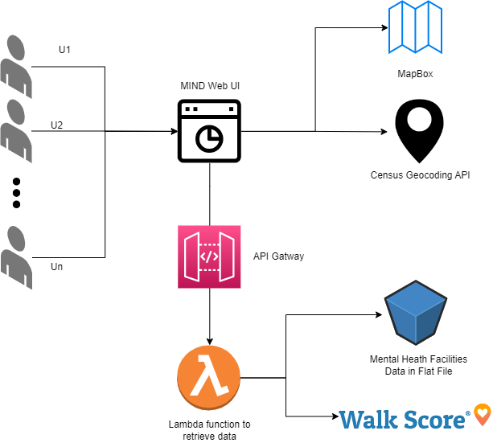

# Mental Health in DC - Maryland - Virgina (MIND)
*I think it's always nice to have a gif or image here of the app. Then the link to app below.*  

[Link to Mental Health in DC - Maryland - Virgina (MIND)](https://mind.summitllc.us/)
## Description
MIND is a website developed by Summit Consulting, LLC's data science and software development teams as part of the [2023 Health Equity Data Jam](https://healthdata.gov/stories/s/Health-Equity-DataJam-Homepage-2023/nqx6-g6vz), which seeks to promote fair and equal access to healthcare. Our theme for the project was Access to Care, with a specific focus on mental health facility accessibility based on transportation preferences. We recognized that proximity alone does not guarantee the most desirable location for a mental health facility, as factors like parking, traffic, and safety can vary greatly depending on the area. To address this, our website features sliders that allow users to customize their preferences based on walkability, metro accessibility, and bike-friendliness. By highlighting these factors, we hope to help users find mental health facilities that are not only close by, but also safe, convenient, and comfortable.

## How To Use
To use our website, start by entering your address within the DC, Maryland, and Virginia region. You can then apply filters such as preferred languages, payment options, and other criteria. Next, use the sliders to indicate your preferred mode of transportation, whether it be walking, taking the metro, or biking. Based on these inputs, our website will populate a list of recommended mental health facilities ranked by proximity and your preferred mode of transportation. You can experiment with the sliders to observe how the rankings change based on your transportation preferences. Finally, a map with pins will display each facility's location.

## Architecture

- NextJS 13.2.4
- React 18.2.0
- AWS EC2
- AWS API Gateway
- AWS Lambda
- Python

## Public Data Sources Utilized
We used two publically available datasets used in this application. 
- Mental heath treatment facilities were collected form [FindTreatment.gov](https://www.findtreatment.gov), then filtered down to include only facilities from Virginia, Maryland, and the District of Columbia.
- The user's longitude and lattitude coordinates are retrieved from the [US Census Geocoding API](https://geocoding.geo.census.gov/geocoder/).

## Additional Resources Utilized
Part of our scoring algorithm relies on metrics provided by [Walk Score](https://www.walkscore.com/). We utilized MapBox to provide mapping visuals. 

## Summit Team Contributors
- Tyler Whitaker - Data Scientist
- Catherine Sun - Data Scientist
- Quan Nguyen - Software Developer
- Kyle Follendorf - Software Developer
- Scott Senkier - Data/Software Manager